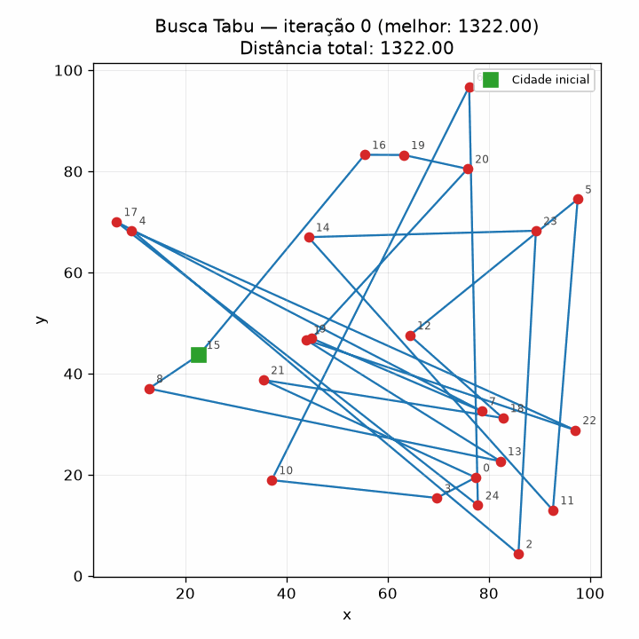
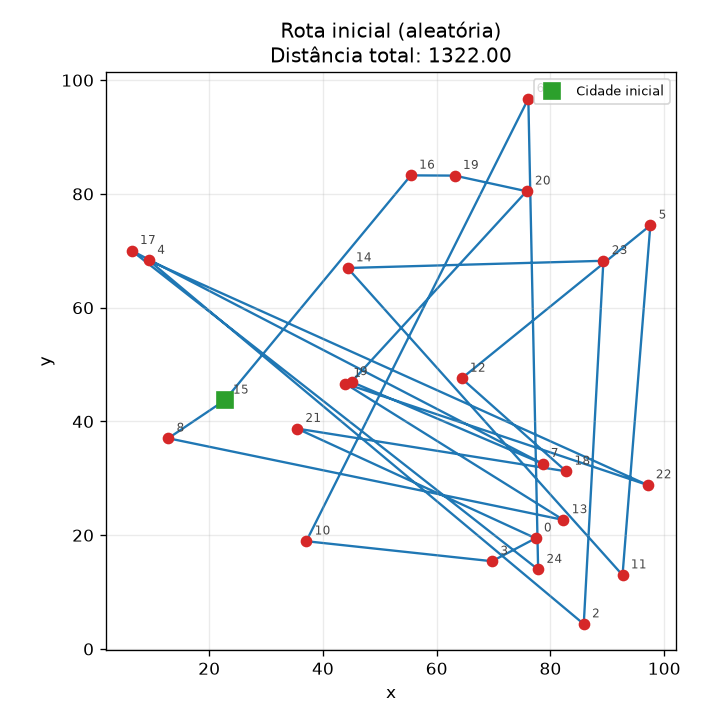
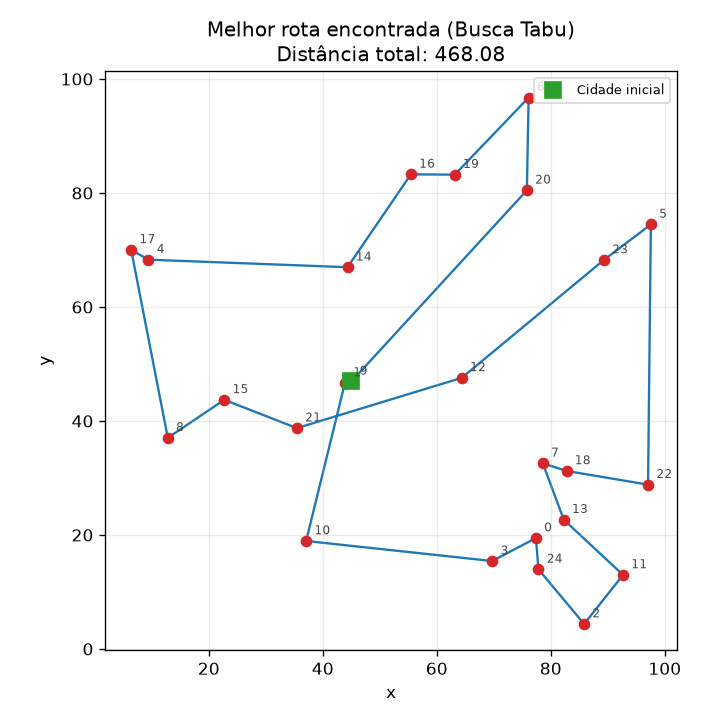
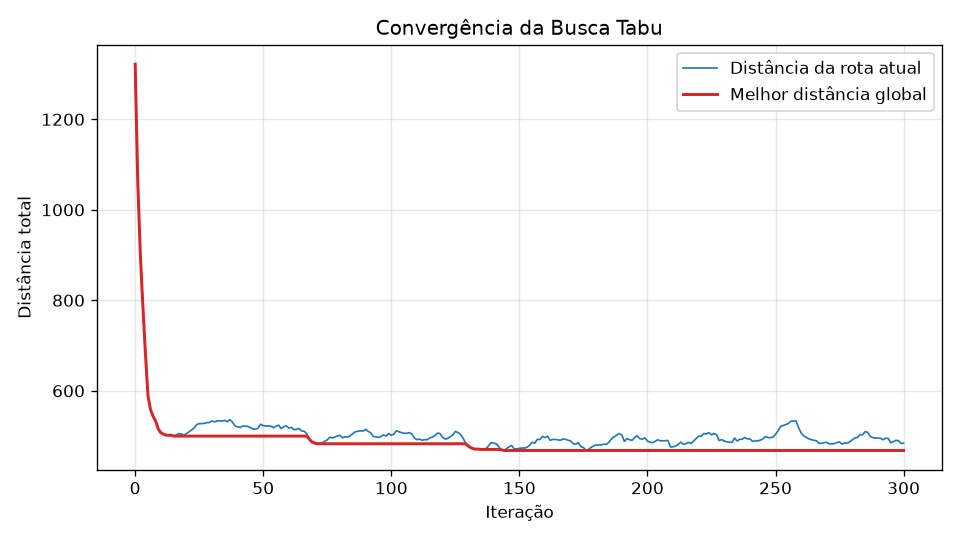

# Problema do Caixeiro Viajante (TSP) resolvido com Busca Tabu

Implementação em Python da metaheurística **Busca Tabu (Tabu Search)** aplicada ao
**Problema do Caixeiro Viajante (PCV / TSP)**, com saídas visuais estáticas (PNG),
animação da evolução da busca (GIF) e uma interface interativa em Streamlit.



---

## 1. Identificação

| | |
|---|---|
| **Aluno** | Artur Martins Silva |
| **Instituição** | Instituto Federal do Piauí (IFPI) — Campus Picos |
| **Disciplina** | Tópicos Especiais em Computação (Implementação em Otimização Combinatória) |
| **Professor** | João Paulo Lima do Nascimento |
| **Tema** | Problema do Caixeiro Viajante (TSP) |
| **Estratégia** | Busca Tabu (metaheurística) |

---

## 2. Introdução

### 2.1 Contexto do problema

O **Problema do Caixeiro Viajante** (*Travelling Salesman Problem* — TSP) é um dos
problemas mais estudados da Otimização Combinatória. O enunciado é simples:

> Dado um conjunto de *n* cidades e as distâncias entre cada par delas, encontrar o
> ciclo de menor distância total que visite **cada cidade exatamente uma vez** e
> **retorne à cidade de origem**.

Neste projeto trabalhamos com o **TSP euclidiano simétrico**: as cidades são pontos
`(x, y)` no plano e a distância entre duas cidades *i* e *j* é a distância euclidiana
(portanto `d(i,j) = d(j,i)`).

Apesar do enunciado simples, o TSP tem enorme relevância prática — roteirização de
entregas, coleta de resíduos, planejamento de rotas de manutenção, sequenciamento de
perfurações em placas de circuito impresso, ordenação de tarefas com custo de troca —
e é o caso-padrão para estudo de heurísticas em problemas difíceis.

### 2.2 Por que não usar força bruta: a explosão combinatória

O número de ciclos distintos para *n* cidades é `(n-1)! / 2`. Fixando a cidade inicial
e descontando o fato de que percorrer o ciclo ao contrário dá a mesma distância:

| Cidades (*n*) | Rotas possíveis |
|---|---|
| 5 | 12 |
| 10 | 181.440 |
| 15 | ≈ 4,4 × 10¹⁰ |
| 20 | ≈ 6,1 × 10¹⁶ |
| 25 | ≈ 3,1 × 10²³ |

Com as **25 cidades** usadas como instância padrão deste trabalho, a enumeração
completa exigiria avaliar cerca de 3 × 10²³ rotas — inviável em qualquer computador.

O TSP é um problema **NP-difícil** (sua versão de decisão é NP-completa), e não se
conhece algoritmo de tempo polinomial que o resolva de forma exata. O melhor algoritmo
exato clássico, a programação dinâmica de **Held–Karp**, roda em `O(n² · 2ⁿ)` tempo e
`O(n · 2ⁿ)` memória — melhor que `O(n!)`, mas ainda exponencial.

### 2.3 Método escolhido: exato ou heurístico?

A estratégia adotada aqui é **heurística — mais precisamente uma metaheurística**:
**Busca Tabu**, proposta por Fred Glover (1986, 1989).

- **Não é um método exato**: não há garantia de encontrar o ótimo global, nem
  certificado de otimalidade (ao contrário de *branch-and-bound* ou *branch-and-cut*).
- **É uma metaheurística de busca local com memória**: parte de uma solução e a
  melhora iterativamente explorando uma *vizinhança*, usando uma estrutura de memória
  (a **lista tabu**) para escapar de ótimos locais.

A diferença essencial em relação a uma busca local pura (*hill climbing*) é que a busca
local pura para no primeiro ótimo local que encontra. A Busca Tabu **aceita movimentos
de piora** quando não há melhoria disponível e **proíbe temporariamente** os movimentos
recém-executados, impedindo que o algoritmo desfaça imediatamente o que acabou de fazer
e fique preso ciclando entre as mesmas soluções.

### 2.4 Complexidade da implementação

| Elemento | Custo |
|---|---|
| Matriz de distâncias (pré-computada uma única vez) | `O(n²)` tempo e memória |
| Tamanho da vizinhança (todos os *swaps* de pares) | `C(n,2) = n(n-1)/2 = O(n²)` vizinhos |
| Avaliação da função objetivo de um vizinho | `O(n)` (soma das *n* arestas do ciclo) |
| **Custo de uma iteração** | **`O(n³)`** |
| **Custo total da busca** | **`O(k · n³)`**, com *k* = número de iterações |

O custo é **polinomial e controlável** pelos parâmetros: escolhemos *quanto* tempo
gastar (via `k`), em troca de abandonar a garantia de otimalidade. É exatamente esse o
compromisso central das metaheurísticas.

> Observação de implementação: seria possível avaliar cada vizinho em `O(1)` calculando
> apenas o *delta* das 4 arestas afetadas pelo *swap*, o que reduziria a iteração a
> `O(n²)`. Optou-se pela avaliação completa e vetorizada com NumPy por ser muito mais
> legível e didática — a prioridade deste trabalho é a clareza do algoritmo. O ganho
> real de desempenho é discutido na conclusão.

---

## 3. Desenvolvimento

### 3.1 Dados do problema (instância)

As instâncias são geradas **sinteticamente** pela função `gerar_cidades`:

- `n` cidades com coordenadas `(x, y)` sorteadas uniformemente no quadrado
  `[0, 100] × [0, 100]`;
- uma **semente** (`seed`) controla o gerador pseudoaleatório, garantindo
  **reprodutibilidade**: a mesma `seed` sempre produz a mesma instância e a mesma
  solução inicial, o que permite comparar execuções com parâmetros diferentes de forma
  justa;
- a partir das coordenadas, `matriz_distancias` pré-calcula a matriz simétrica `D`,
  onde `D[i][j]` é a distância euclidiana entre as cidades *i* e *j*:

$$D[i][j] = \sqrt{(x_i - x_j)^2 + (y_i - y_j)^2}$$

Pré-computar `D` é a otimização mais importante do projeto: a busca avalia centenas de
vizinhos por iteração, e cada avaliação passa a ser apenas uma soma de valores já
calculados — nenhuma raiz quadrada é recalculada durante a busca.

**Instância padrão do experimento:** 25 cidades, `seed = 42`.

### 3.2 Variáveis de decisão

A solução é representada por **permutação** (representação por ordem):

$$\pi = (\pi_1, \pi_2, \ldots, \pi_n)$$

onde `π` é uma permutação dos índices `0, 1, ..., n-1` e `π_k` é a cidade visitada na
*k*-ésima posição do percurso. No código, uma rota é simplesmente uma lista de inteiros:

```python
rota = [9, 20, 6, 19, 16, ...]   # ordem de visita das cidades
```

Essa representação é bem mais enxuta que a formulação clássica de Programação Linear
Inteira do TSP, que usa variáveis binárias `x_ij ∈ {0,1}` (1 se a aresta *i→j* é usada).
Com `n = 25`, a formulação binária teria 600 variáveis; a permutação usa um único vetor
de 25 posições.

### 3.3 Função objetivo

Minimizar a distância total do ciclo fechado:

$$\min f(\pi) = \sum_{k=1}^{n-1} D[\pi_k][\pi_{k+1}] \;+\; D[\pi_n][\pi_1]$$

O último termo é a **aresta de retorno** da última cidade para a primeira, que fecha o
ciclo. No código (`tsp.distancia_total`) isso é feito de forma vetorizada com
`np.roll`, que desloca a rota uma posição e faz o "próximo do último" ser o primeiro —
o fechamento do ciclo sai naturalmente:

```python
origens  = np.asarray(rota, dtype=int)
destinos = np.roll(origens, -1)          # fecha o ciclo automaticamente
return float(dist[origens, destinos].sum())
```

### 3.4 Restrições

Na formulação clássica, o TSP exige:

1. **Cada cidade é visitada exatamente uma vez** (grau de entrada = grau de saída = 1);
2. **A rota é um único ciclo fechado** — não pode se fragmentar em subciclos
   desconexos (*subtour elimination*, a restrição mais difícil de modelar em PLI, exigindo
   as restrições de Dantzig–Fulkerson–Johnson ou de Miller–Tucker–Zemlin);
3. **A rota retorna à cidade de origem**.

**Como este projeto trata as restrições:** a representação por permutação as satisfaz
**por construção**, e isso é uma vantagem prática importante da abordagem heurística:

| Restrição | Como é garantida |
|---|---|
| Cada cidade exatamente uma vez | Uma permutação, por definição, contém cada índice uma única vez |
| Ciclo único (sem subciclos) | Uma permutação lida sequencialmente é um único ciclo hamiltoniano |
| Retorno à origem | A função objetivo sempre soma a aresta `π_n → π_1` |
| Movimento preserva a viabilidade | O *swap* de duas posições de uma permutação resulta em outra permutação |

Ou seja: **toda solução manipulada pelo algoritmo é sempre viável** — não é necessário
nenhum mecanismo de reparo, penalização ou verificação de factibilidade.

### 3.5 A estratégia: Busca Tabu em detalhes

#### a) Solução inicial

`rota_inicial(n, seed)` gera uma **permutação puramente aleatória**. A escolha é
deliberada: partir de uma solução ruim torna visível, nos gráficos e no GIF, o quanto a
busca de fato melhora a rota. Uma solução inicial gulosa (vizinho mais próximo) já
começaria boa e esconderia esse efeito didático.

#### b) Estrutura de vizinhança: *swap* de pares

`vizinhos_swap(rota)` gera a vizinhança `N(s)` trocando de lugar as cidades de duas
posições *i* e *j* da rota:

```
rota atual:  [A, B, C, D, E]
swap(1, 3):  [A, D, C, B, E]     movimento registrado: (1, 3)
```

- Tamanho da vizinhança: `C(n,2) = n(n-1)/2`. Para 25 cidades, **300 vizinhos por
  iteração**, todos avaliados a cada passo (estratégia de *melhor vizinho*, não de
  *primeiro vizinho que melhora*).
- Só geramos pares com `i < j`, pois o *swap* é simétrico: `(i,j)` e `(j,i)`
  produzem o mesmo vizinho e devem ser tratados como **o mesmo movimento** na lista tabu.
- A função devolve pares `(rota_vizinha, movimento)` — é o `movimento` que vai para a
  lista tabu.

#### c) Lista tabu

Implementada como um `collections.deque` com `maxlen = tamanho_tabu`:

```python
lista_tabu = deque(maxlen=tamanho_tabu)   # FIFO com descarte automático
...
lista_tabu.append(melhor_movimento)       # o mais antigo sai sozinho
```

O `maxlen` dá exatamente a semântica de uma **memória de curto prazo com *tenure* fixa**:
um movimento fica proibido pelas próximas `tamanho_tabu` iterações e depois volta a ser
permitido, sem nenhum código de expiração manual.

O efeito de proibir o par `(i, j)` é impedir que a busca **desfaça** a troca que acabou
de realizar — que é justamente o movimento mais tentador quando aceitamos uma piora,
e a causa do ciclo infinito que travaria uma busca local ingênua.

Sobre o **ajuste do parâmetro**: valores pequenos deixam a busca ciclar; valores grandes
demais engessam a busca, proibindo boa parte da vizinhança (veja os resultados na
seção 4.2).

#### d) Critério de aspiração

Um movimento tabu é **liberado** se levar a uma solução melhor que a melhor solução
global já encontrada:

```python
eh_tabu   = movimento in lista_tabu
aspiracao = d_vizinho < melhor_distancia    # melhor que a melhor global

if eh_tabu and not aspiracao:
    continue                                # proibido e sem mérito -> descarta
```

A justificativa é direta: seria absurdo recusar a melhor solução já vista apenas porque
o movimento que leva a ela está temporariamente proibido. A lista tabu é uma heurística
de diversificação, não um fim em si — o critério de aspiração corrige seu excesso de zelo.

#### e) Critério de parada

**Número fixo de iterações** (`iteracoes`, padrão 300). É o critério mais simples e
suficiente para o escopo do trabalho; alternativas comuns seriam parar após *k*
iterações sem melhoria, ou por limite de tempo.

#### f) Pseudocódigo do laço principal

```
s  <- solução inicial aleatória
s* <- s                                  # melhor solução global
T  <- lista tabu vazia (tamanho fixo)

para it = 1 até ITERACOES:
    melhor_candidato <- nulo
    para cada (vizinho, movimento) em N(s):
        se movimento ∈ T e f(vizinho) >= f(s*):   # tabu sem aspiração
            descartar
        senão se f(vizinho) < f(melhor_candidato):
            melhor_candidato <- vizinho

    s <- melhor_candidato          # move-se MESMO SE for pior que s (escape)
    T <- T ∪ {movimento}           # o mais antigo expira (FIFO)

    se f(s) < f(s*):
        s* <- s                    # atualiza a melhor global

retornar s*, f(s*), histórico
```

O ponto crucial é a linha `s <- melhor_candidato`: a busca se move para o melhor vizinho
admissível **mesmo que ele seja pior que a solução atual**. É isso que permite atravessar
"vales" do espaço de soluções e sair de ótimos locais.

#### g) Histórico

`busca_tabu` devolve, além da melhor rota e sua distância, um **histórico** com um
registro por iteração:

```python
{"iteracao": 42, "rota": [...], "distancia": 512.3, "melhor_distancia": 468.1}
```

É esse histórico que alimenta toda a parte visual: a curva de convergência, os frames do
GIF e o *slider* da interface Streamlit.

### 3.6 Linguagem e bibliotecas

- **Linguagem:** Python 3 (testado em Python 3.14).
- **[NumPy](https://numpy.org/)** — matriz de distâncias e avaliação vetorizada da
  função objetivo; geração reprodutível de números aleatórios (`default_rng`).
- **[Matplotlib](https://matplotlib.org/)** — gráficos da rota e da convergência
  (com o *backend* `Agg`, que renderiza para arquivo sem precisar de janela gráfica).
- **[imageio](https://imageio.readthedocs.io/)** — montagem do GIF a partir dos frames.
- **[Streamlit](https://streamlit.io/)** — interface interativa no navegador.

Nenhuma biblioteca de otimização (OR-Tools, PuLP, etc.) foi utilizada: **todo o
algoritmo é implementado manualmente**, como exige o trabalho.

### 3.7 Estrutura do projeto e detalhes de implementação

```
tsp-busca-tabu/
├── README.md            # este documento
├── requirements.txt     # dependências
├── main.py              # script de linha de comando: roda o experimento e gera as imagens/GIF
├── tsp.py               # LÓGICA: modelagem do TSP + metaheurística Busca Tabu
├── visualizacao.py      # VISUALIZAÇÃO estática: plots PNG e animação GIF
├── interface.py         # VISUALIZAÇÃO interativa: aplicação Streamlit
├── rota_inicial.png     # (gerado) rota inicial aleatória
├── rota_final.png       # (gerado) melhor rota encontrada
├── convergencia.png     # (gerado) distância x iteração
└── evolucao.gif         # (gerado) animação da evolução da busca
```

**Separação de responsabilidades.** A decisão de arquitetura mais importante do projeto é
que **`tsp.py` não importa nada de visualização** — não conhece matplotlib, imageio nem
Streamlit. Ele apenas recebe dados, executa o algoritmo e devolve resultados + histórico.
As consequências práticas:

- é possível remover ou trocar toda a camada visual sem tocar em uma linha do algoritmo;
- o algoritmo pode ser reutilizado em outro contexto (notebook, API, testes automatizados);
- `main.py` e `interface.py` consomem **exatamente as mesmas funções**, sem nenhuma
  duplicação de lógica.

**Truque que faz `visualizacao.py` servir aos dois mundos.** As funções de plot aceitam
`caminho_arquivo=None`. Se um caminho é informado, a figura é salva em disco e fechada
(uso do `main.py` e dos frames do GIF); se é `None`, a função **devolve o objeto
`Figure`** do matplotlib, que o Streamlit renderiza com `st.pyplot(fig)`. Um único código
de plotagem atende às duas saídas.

**Outros detalhes relevantes:**

- **Geração do GIF** (`gerar_gif`): renderiza um PNG por frame em `frames_temp/`, monta o
  GIF e **apaga a pasta temporária** dentro de um bloco `finally` (a limpeza acontece
  mesmo se algo falhar no meio). O parâmetro `passo` faz subamostragem — 1 frame a cada
  *N* iterações — para o GIF não ficar gigante; a última iteração é sempre incluída, para
  a animação terminar no estado final da busca.
- **Limites fixos dos eixos**: no GIF e no *slider*, os limites dos eixos são calculados
  uma vez e reaplicados em todos os frames. Sem isso, cada frame se ajustaria à sua
  própria escala e a animação ficaria "tremida".
- **Estado na interface** (`st.session_state`): o Streamlit reexecuta o script inteiro a
  cada interação do usuário. Guardar o resultado da busca no `session_state` evita que
  arrastar o *slider* dispare uma nova execução completa da busca tabu.
- **`plt.close(fig)`** após salvar cada frame: sem isso, gerar dezenas de figuras
  acumularia memória.

### 3.8 Instruções de execução

#### Pré-requisitos

- Python 3.9 ou superior
- `pip`

#### Instalação

```bash
# 1. clone o repositório
git clone https://github.com/ArturMSilva/tsp-busca-tabu.git
cd tsp-busca-tabu

# 2. (recomendado) crie um ambiente virtual
python -m venv .venv
# Windows:
.venv\Scripts\activate
# Linux / macOS:
source .venv/bin/activate

# 3. instale as dependências
pip install -r requirements.txt
```

#### Opção A — Script principal (gera as imagens e o GIF)

```bash
python main.py
```

Saída no terminal:

```
==============================================================
 TSP com Busca Tabu — Otimização Combinatória (IFPI Picos)
==============================================================
Cidades............: 25
Iterações..........: 300
Tamanho lista tabu.: 15
Seed...............: 42
--------------------------------------------------------------
Distância inicial (rota aleatória).: 1322.00
Melhor distância encontrada........: 468.08
Melhoria...........................: 64.59%
Tempo de execução..................: 1.27 s
```

E os arquivos gerados: `rota_inicial.png`, `rota_final.png`, `convergencia.png`,
`evolucao.gif`.

Os parâmetros podem ser alterados por linha de comando:

```bash
python main.py --cidades 40 --iteracoes 500 --tabu 20 --seed 7
python main.py --sem-gif            # execução mais rápida, sem gerar o GIF
python main.py --passo-gif 10       # GIF mais leve (1 frame a cada 10 iterações)
python main.py --help               # lista todas as opções
```

#### Opção B — Interface interativa (Streamlit)

```bash
streamlit run interface.py
```

O navegador abre em `http://localhost:8501` com:

- campos na barra lateral para **número de cidades**, **número de iterações**,
  **tamanho da lista tabu** e **seed**;
- botão **▶️ Rodar Busca Tabu**;
- **slider** para navegar iteração por iteração pelo histórico, com o plot da rota
  atualizando em tempo real (ao lado da melhor rota global, para comparação);
- **gráfico de convergência** (distância × iteração);
- **métricas**: distância inicial, melhor distância encontrada e percentual de melhoria.

> As duas opções são **independentes**: quem quiser apenas ver o resultado usa o GIF
> gerado pelo `main.py`; quem quiser explorar a busca em detalhe usa o Streamlit.

#### Como embutir o GIF no README

Depois de rodar `python main.py`, o arquivo `evolucao.gif` fica na raiz do projeto.
Basta referenciá-lo em Markdown (é o que este README faz, logo abaixo do título):

```markdown

```

Como o `.gitignore` **não** ignora as imagens geradas, elas são versionadas junto com o
código e o GitHub exibe a animação diretamente na página do repositório — sem exigir que
o leitor execute o projeto.

---

## 4. Resultados

### 4.1 Experimento padrão (25 cidades, 300 iterações, lista tabu de 15, seed 42)

| Métrica | Valor |
|---|---|
| Distância da rota inicial (aleatória) | **1322,00** |
| Melhor distância encontrada | **468,08** |
| Redução | **64,59%** |
| Tempo de execução | ≈ 1,3 s |
| Soluções avaliadas | 300 iterações × 300 vizinhos = **90.000** |

Vale registrar a ordem de grandeza: a busca encontrou uma rota 64,6% melhor que a
inicial avaliando **90 mil** soluções, de um espaço de busca com cerca de
**3 × 10²³** rotas — ou seja, explorando uma fração inimaginavelmente pequena do total.

| Rota inicial (aleatória) | Melhor rota encontrada |
|---|---|
|  |  |

### 4.2 Análise de convergência



O gráfico de convergência é o resultado mais informativo do trabalho, porque mostra o
**mecanismo** da Busca Tabu em funcionamento:

- A **curva vermelha** (melhor distância global) é monotonicamente não-crescente: ela
  cai muito rápido nas primeiras ~10 iterações (de 1322 para cerca de 500) e depois
  melhora em degraus cada vez mais raros — em torno das iterações 70 e 130.
- A **curva azul** (distância da rota atual) **oscila permanentemente** em torno da
  melhor solução. Essa oscilação **não é um defeito, é o algoritmo trabalhando**: nas
  iterações em que nenhum vizinho melhora a solução, a busca aceita o "menos pior",
  sobe um pouco e continua explorando. Uma busca local pura teria a curva azul colada na
  vermelha e travaria por volta da iteração 10, no primeiro ótimo local (≈ 500).
- Os degraus da curva vermelha **acontecem depois de períodos de oscilação** — ou seja,
  as melhorias tardias só foram possíveis porque o algoritmo aceitou piorar antes.

### 4.3 Sensibilidade ao tamanho da lista tabu

25 cidades, 300 iterações, seed 42 (mesma instância e mesma solução inicial):

| Tamanho da lista tabu | Melhor distância |
|---|---|
| 1 | 499,88 |
| 5 | 499,88 |
| 15 | 468,08 |
| **30** | **428,53** |
| 50 | 467,38 |

O comportamento observado confirma a teoria: listas **muito curtas** (1 e 5) não impedem
a busca de voltar aos mesmos movimentos, e o resultado empata exatamente com o valor de
499,88 — o primeiro ótimo local, do qual essas configurações não conseguem escapar. À
medida que a lista cresce, a busca ganha capacidade de diversificação e melhora
(468,08 com 15 e 428,53 com 30). Mas o ganho **não é monótono**: com 50 movimentos
proibidos — de uma vizinhança de 300 — a busca fica excessivamente restrita e o
resultado piora novamente (467,38).

### 4.4 Sensibilidade ao número de iterações

| Iterações | Melhor distância | Tempo |
|---|---|---|
| 50 | 499,88 | 0,22 s |
| 100 | 482,95 | 0,45 s |
| 300 | 468,08 | 1,19 s |
| 1000 | 465,09 | 4,05 s |

Retornos claramente decrescentes: triplicar as iterações de 300 para 1000 (3,4× mais
tempo) melhorou o resultado em apenas 0,6%. O grosso do ganho acontece nas primeiras
dezenas de iterações.

### 4.5 Escalabilidade

300 iterações, lista tabu de 15, seed 42:

| Cidades | Distância inicial | Melhor distância | Melhoria | Tempo |
|---|---|---|---|---|
| 10 | 474,10 | 310,81 | 34,4% | 0,17 s |
| 25 | 1322,00 | 468,08 | 64,6% | 1,23 s |
| 50 | 2553,86 | 727,96 | 71,5% | 5,32 s |
| 80 | 3766,55 | 1133,47 | 69,9% | 14,96 s |

O crescimento do tempo é compatível com o `O(k · n³ )` previsto na seção 2.4: de 25 para
50 cidades (2× as cidades), o tempo cresceu ≈ 4,3×. Note também que instâncias maiores
apresentam melhoria percentual **maior** — não porque a busca fique melhor, mas porque a
rota inicial aleatória fica proporcionalmente muito pior à medida que *n* cresce.

### 4.6 Robustez em relação à solução inicial

Mesma instância de 25 cidades, variando apenas a seed da rota inicial:

| Seed | Melhor distância |
|---|---|
| 1 | 430,94 |
| 7 | 451,96 |
| 42 | 468,08 |
| 99 | **395,38** |
| 2024 | 418,66 |

Média 433,00; mínimo 395,38; máximo 468,08 — uma dispersão de cerca de **18%** entre o
melhor e o pior resultado. Esse é o retrato honesto de uma metaheurística: o resultado
**depende do ponto de partida** e não há garantia de otimalidade. Na prática, isso
justifica a estratégia de *multi-start* — executar várias vezes com sementes diferentes e
guardar a melhor solução.

---

## 5. Conclusão

### 5.1 Discussão dos resultados

A Busca Tabu se mostrou muito eficaz para o TSP dentro do escopo deste trabalho. Na
instância padrão, reduziu a distância da rota em **64,6%** em pouco mais de **1 segundo**,
avaliando 90 mil soluções de um espaço de 10²³ — uma demonstração concreta de por que
metaheurísticas são a ferramenta prática para problemas NP-difíceis de porte médio.

Os experimentos deixaram três lições claras:

1. **A memória de curto prazo é o que faz o algoritmo funcionar.** A comparação da
   seção 4.3 é a evidência mais direta: com uma lista tabu de tamanho 1 ou 5, a busca
   fica presa em 499,88 (o primeiro ótimo local); ampliando a lista, chega a 428,53.
   A diferença não vem da vizinhança nem do critério de parada, mas exclusivamente da
   memória que proíbe desfazer movimentos recentes.
2. **Aceitar piorar é indispensável.** No gráfico de convergência, todas as melhorias
   após a iteração ~10 aparecem depois de trechos de oscilação. Sem a permissão de
   piorar, a curva teria travado no primeiro ótimo local.
3. **Os parâmetros importam e não são monótonos.** O melhor tamanho de lista tabu
   testado foi 30, não o maior valor (50). Mais restrição não é sinônimo de melhor
   resultado — há um ponto ótimo intermediário entre ciclar e engessar. Vale registrar
   que o valor padrão adotado (15) não foi o melhor encontrado; ele foi mantido porque o
   objetivo era demonstrar o algoritmo, não fazer *tuning* fino de parâmetros.

Também é honesto apontar as **limitações**. Ao inspecionar a `rota_final.png` de perto,
ainda se observam **cruzamentos de arestas** — e em um TSP euclidiano, cruzamento é
prova de sub-otimalidade (descruzar sempre encurta a rota, pela desigualdade triangular).
A causa é a estrutura de vizinhança escolhida: o *swap* troca duas cidades de posição,
mas não é o movimento natural para descruzar arestas. O movimento **2-opt** — que
inverte um segmento inteiro da rota — remove cruzamentos diretamente e é reconhecidamente
superior ao *swap* para o TSP. O *swap* foi mantido por ser o exigido no escopo do
trabalho e por ser mais simples de explicar e de visualizar.

### 5.2 Dificuldades encontradas

- **Definir o que exatamente é "um movimento tabu".** A primeira dúvida real do projeto:
  proibir o *par de cidades* trocado ou o *par de posições*? E `(i,j)` e `(j,i)` são o
  mesmo movimento? A solução foi normalizar sempre para `i < j` na geração da vizinhança,
  garantindo que a lista tabu não trate a mesma proibição como duas diferentes.
- **Calibrar o tamanho da lista tabu.** Não existe valor universal; foi necessário
  experimentar (seção 4.3) para entender o comportamento em U — ciclagem quando é curta,
  engessamento quando é longa demais.
- **O caso extremo de todos os vizinhos proibidos.** Com vizinhança pequena e lista tabu
  grande, pode não sobrar nenhum candidato admissível. Sem tratamento, o código quebraria
  com `None`. A solução foi registrar a iteração sem mover-se e seguir: a lista tabu
  esvazia com o tempo e a busca volta a ter opções.
- **Custo e peso do GIF.** A primeira versão gerava um frame por iteração — 300 imagens,
  lento e pesado. Resolvido com o parâmetro `passo` (subamostragem) e com a limpeza
  automática da pasta temporária.
- **Reexecução do script pelo Streamlit.** Comportamento inesperado no início: cada
  movimento do slider reexecutava a busca tabu inteira, deixando a interface lenta.
  Entender o modelo de execução do Streamlit e usar o `st.session_state` resolveu.
- **Instabilidade visual da animação.** Sem fixar os limites dos eixos, cada frame se
  ajustava à sua própria escala e o GIF ficava tremido — resolvido calculando os limites
  uma única vez e aplicando-os a todos os frames.

### 5.3 Considerações finais

O trabalho cumpriu o objetivo de implementar, do zero, uma metaheurística clássica e
observar seu comportamento empiricamente. O aprendizado mais valioso não foi a codificação
em si — a Busca Tabu tem um laço principal notavelmente simples — mas perceber **como um
mecanismo mínimo de memória transforma uma busca local que trava numa busca capaz de
explorar o espaço de soluções de forma sistemática**.

Melhorias naturais para trabalhos futuros:

- **Vizinhança 2-opt** (inversão de segmento) no lugar do *swap*, eliminando os
  cruzamentos de arestas;
- **Avaliação incremental em `O(1)`** por vizinho, calculando apenas o *delta* das 4
  arestas afetadas, reduzindo a iteração de `O(n³)` para `O(n²)`;
- **Lista tabu dinâmica** (*reactive tabu search*), ajustando a *tenure* automaticamente
  conforme a busca estagna ou cicla;
- **Memória de longo prazo** com estratégias de intensificação e diversificação —
  reiniciar de regiões promissoras ou penalizar atributos frequentes;
- **Comparação com um método exato** (Held–Karp) em instâncias pequenas (*n* ≤ 15), para
  medir o *gap* real em relação ao ótimo, e com instâncias de referência da
  **TSPLIB**, que possuem ótimos conhecidos.

---

## 6. Referências

1. **GLOVER, F.** Tabu Search — Part I. *ORSA Journal on Computing*, v. 1, n. 3,
   p. 190–206, 1989. (Artigo seminal que formaliza a Busca Tabu, a lista tabu e os
   critérios de aspiração.)

2. **GLOVER, F.; LAGUNA, M.** *Tabu Search*. Boston: Kluwer Academic Publishers, 1997.
   (Obra de referência definitiva sobre o método, incluindo memória de curto e longo
   prazo, intensificação e diversificação.)

3. **APPLEGATE, D. L.; BIXBY, R. E.; CHVÁTAL, V.; COOK, W. J.** *The Traveling Salesman
   Problem: A Computational Study*. Princeton: Princeton University Press, 2006.
   (Estudo computacional definitivo sobre o TSP e o solver Concorde.)

4. **LAWLER, E. L.; LENSTRA, J. K.; RINNOOY KAN, A. H. G.; SHMOYS, D. B. (eds.)** *The
   Traveling Salesman Problem: A Guided Tour of Combinatorial Optimization*. Chichester:
   John Wiley & Sons, 1985. (Referência clássica sobre formulações e complexidade do TSP.)

5. **GENDREAU, M.; POTVIN, J.-Y. (eds.)** *Handbook of Metaheuristics*. 3. ed. Cham:
   Springer, 2019. (Panorama atualizado das metaheurísticas, com capítulo dedicado à
   Busca Tabu.)

6. **TALBI, E.-G.** *Metaheuristics: From Design to Implementation*. Hoboken: John Wiley
   & Sons, 2009. (Tratamento didático do projeto de vizinhanças e da implementação de
   buscas locais com memória.)

7. **CORMEN, T. H.; LEISERSON, C. E.; RIVEST, R. L.; STEIN, C.** *Algoritmos: Teoria e
   Prática*. 3. ed. Rio de Janeiro: Elsevier, 2012. (Referência para complexidade
   computacional, NP-completude e o TSP como problema NP-difícil.)

---

## Licença

Projeto acadêmico de uso livre para fins educacionais.
